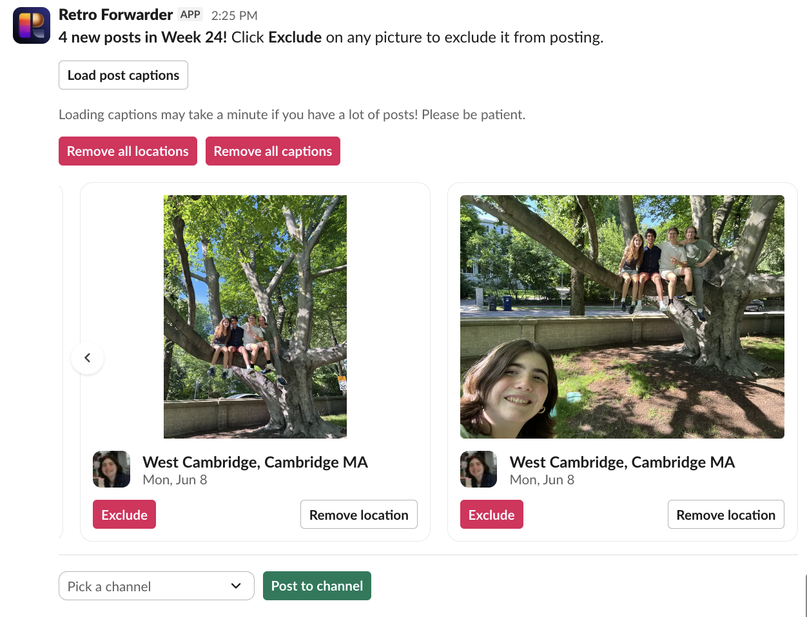

# Retro post forwarder to Slack!

forward your posts on [Retro](https://retro.app) to Slack!

this bot is deployed on hack club slack as [@Retro Forwarder](https://hackclub.enterprise.slack.com/archives/D0A6127GQ3V). anyone can link their account and use it!

_this bot uses my [retro sdk](https://github.com/EerierGosling/retro-sdk), available on PyPi as [retro-sdk](https://pypi.org/project/retro-sdk/)_

you can forward any set of posts from the app home page:

and when you post new pictures, the app sends you a dm asking if you want to forward them anywhere:
